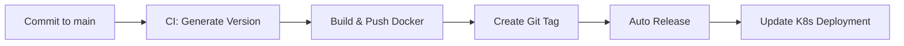

# Estratégia de Versionamento Unificado

Este documento descreve como o sistema de versionamento automático funciona no projeto YRN.

## 🎯 **Objetivo**

Manter versões **sincronizadas** entre:
- ✅ **Docker Images** (CI/CD automático)
- ✅ **GitHub Releases** (automático)
- ✅ **Kubernetes Deployments** (automático)
- ✅ **Binários** (automático)

## 🔄 **Fluxo de Versionamento**

### 1. **Commit em `main`** → Versionamento Automático


### 2. **Algoritmo de Versionamento**
```bash
# Pega a última tag existente
LATEST_TAG = git describe --tags --abbrev=0

# Extrai números da versão (v1.2.3)
MAJOR.MINOR.PATCH = parse(LATEST_TAG)

# Auto-incrementa PATCH para CI builds
NEW_VERSION = v${MAJOR}.${MINOR}.${PATCH + 1}
```

### 3. **Exemplo Prático**
```
Última release: v0.1.0
Novo commit: feat: adiciona plugin X
→ CI gera: v0.1.1
→ Docker: ghcr.io/yrn-go/yrn:v0.1.1
→ Tag: v0.1.1 (automática)
→ Release: v0.1.1 (automática)
→ K8s: image: ghcr.io/yrn-go/yrn:v0.1.1
```

## 🛠 **Workflows Envolvidos**

### **1. test-and-build.yaml** (CI Principal)
- **Trigger**: Push para `main`
- **Ações**:
  - ✅ Gera versão automática (PATCH++)
  - ✅ Build e push da imagem Docker
  - ✅ Cria tag git automática
  - ✅ Atualiza deployment K8s

### **2. auto-release.yaml** (Release Automática)
- **Trigger**: Tag criada pelo CI
- **Ações**:
  - ✅ Verifica se imagem Docker existe
  - ✅ Build binários multiplataforma
  - ✅ Gera changelog automático
  - ✅ Cria GitHub Release

### **3. release.yaml** (Release Manual)
- **Trigger**: Tag manual ou workflow_dispatch
- **Uso**: Para releases major/minor planejadas

## 🏷️ **Tipos de Versionamento**

### **Automático (CI)**
```bash
# A cada commit em main
v0.1.0 → v0.1.1 → v0.1.2 → v0.1.3
```

### **Manual (Planejado)**
```bash
# Para releases importantes
git tag v1.0.0  # Major release
git tag v0.2.0  # Minor release
```

### **Pre-releases**
```bash
git tag v1.0.0-beta.1   # Marcado como prerelease
git tag v1.0.0-rc.1     # Release candidate
```

## 📦 **Artefatos Gerados**

Para cada versão `v1.2.3`:

### **Docker Images**
- `ghcr.io/yrn-go/yrn:v1.2.3`
- `ghcr.io/yrn-go/yrn:latest`

### **Binários**
- `yrn-v1.2.3-linux-amd64.tar.gz`
- `yrn-v1.2.3-darwin-amd64.tar.gz`
- `yrn-v1.2.3-windows-amd64.zip`

### **Deployment**
```yaml
image: ghcr.io/yrn-go/yrn:v1.2.3
```

## ⚙️ **Configuração**

### **Variáveis de Ambiente Disponíveis**
```yaml
${{ env.version }}          # v1.2.3
${{ env.version_number }}   # 1.2.3
${{ env.commit_hash }}      # a1b2c (fallback)
```

### **Overrides Manuais**
```bash
# Para forçar uma versão específica
git tag v2.0.0
git push origin v2.0.0
# → Triggera release manual com v2.0.0
```

## 🔍 **Monitoramento**

### **Verificar Versão Atual**
```bash
# Última tag
git describe --tags --abbrev=0

# Imagem Docker atual
docker inspect ghcr.io/yrn-go/yrn:latest

# Deployment K8s atual
kubectl get deployment yrn-admin-api -o jsonpath='{.spec.template.spec.containers[0].image}'
```

### **Debug de Versionamento**
- **GitHub Actions**: Logs detalhados em Actions > test-and-build
- **Container Registry**: Lista de imagens em Packages
- **Releases**: Histórico completo em Releases

## 🚀 **Vantagens**

✅ **Zero intervenção manual** para releases patch
✅ **Versionamento consistente** em todos componentes
✅ **Rastreabilidade completa** (commit → tag → release → deploy)
✅ **Rollback fácil** (todas versões mantidas)
✅ **CI/CD totalmente automatizado**

## 📋 **Próximos Passos**

- [ ] Adicionar validação de breaking changes
- [ ] Implementar auto-increment de MINOR para features
- [ ] Adicionar notificações de release
- [ ] Integrar com sistemas de monitoramento